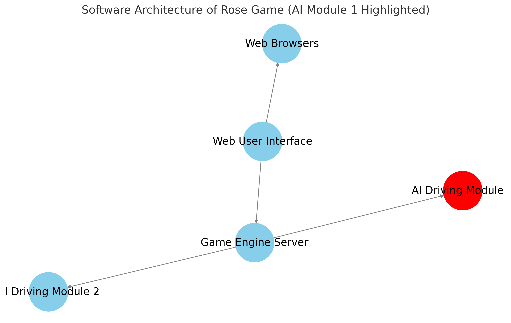

# rose-game-ai
[ROSE game](https://github.com/RedHat-Israel/ROSE) template for self driving car module.

This component is a template for building self driving car modules for the ROSE game.

See the [examples](/examples) directory for more information about creating your own
driving module.

<p align="center">
  
</p>

ROSE project: https://github.com/RedHat-Israel/ROSE

## Requirements

 Requires | Version | |
----------|---------| ---- |
 Podman (or Docker) | >= 4.8 | For running containerized |
 Python   | >= 3.9  | For running the code loally |

## ROSE game components

Component | Reference |
----------|-----------|
Game engine | https://github.com/RedHat-Israel/rose-game-engine |
Game web based user interface | https://github.com/RedHat-Israel/rose-game-web-ui |
Self driving car module | https://github.com/RedHat-Israel/rose-game-ai |

## Running a self driving module

Clone this repository, and make sure you have a game engine running.

Write your own driving module, you can use the file `mydriver.py`:

```bash
vi mydriver.py
```

Run using `mydriver.py` as the driving module:

```bash
make run
```

## Running ROSE game components containerized

### Running the game engine ( on http://127.0.0.1:8880 )

``` bash
podman run --rm --network host -it quay.io/rose/rose-game-engine:latest
```

### Running the game web based user interface ( on http://127.0.0.1:8080 )

``` bash
podman run --rm --network host -it quay.io/rose/rose-game-web-ui:latest
```

### Running your self driving module, requires a local `driver.py` file with your driving module. ( on http://127.0.0.1:8081 )

``` bash
# NOTE: will mount mydriver.py from local directory into the container file system
podman run --rm --network host -it \
  -v $(pwd)/mydriver.py:/mydriver.py:z \
  -e DRIVER /mydriver.py \
  quay.io/rose/rose-game-ai:latest
```
